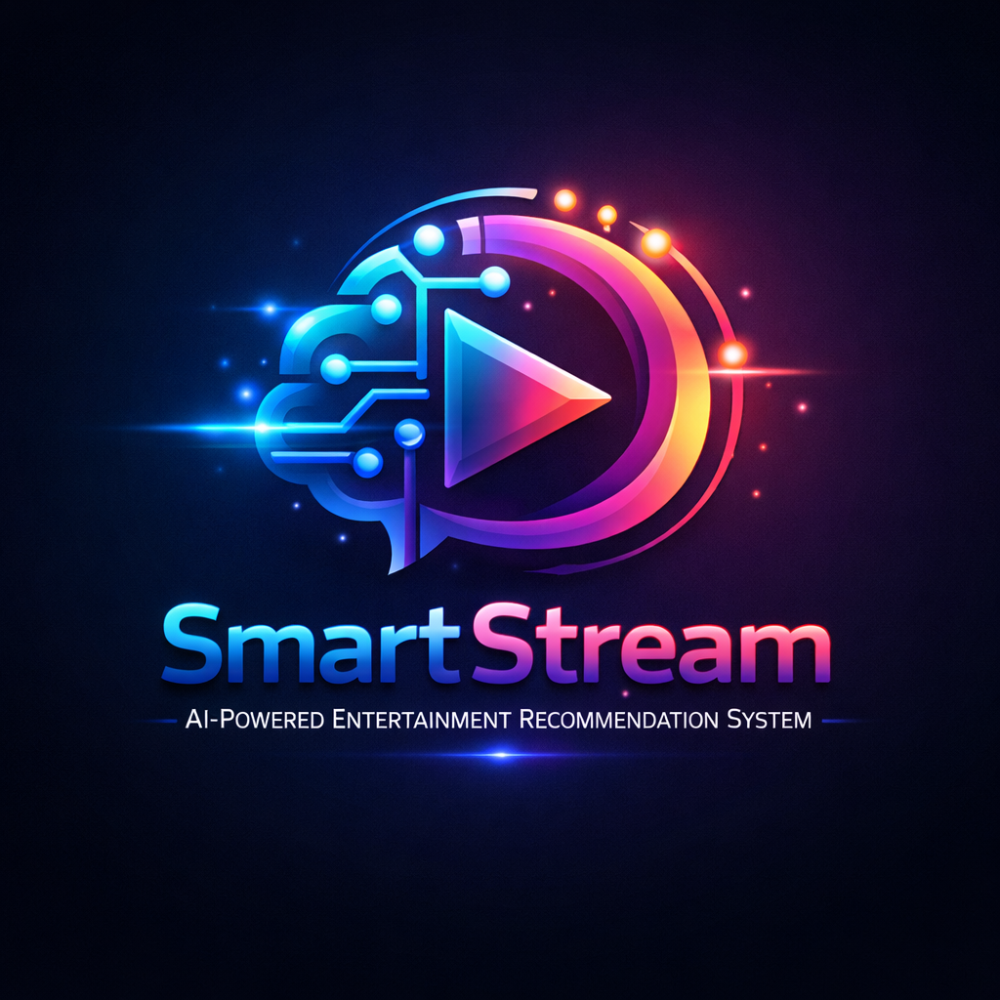

<div align="center">



# 🎬 SmartStream
### AI-Powered Entertainment Recommendation System

[](https://python.org)
[](https://reactjs.org)
[](https://nodejs.org)
[](https://mongodb.com)
[](https://docker.com)
[](LICENSE)

> *Discover what to watch next — powered by intelligent AI that actually understands your taste.*

[🚀 Live Demo](#) · [📖 Docs](#documentation) · [🐛 Report Bug](#) · [✨ Request Feature](#)

</div>

---

## 📌 Table of Contents

- [About the Project](#about-the-project)
- [Features](#features)
- [Tech Stack](#tech-stack)
- [System Architecture](#system-architecture)
- [Getting Started](#getting-started)
  - [Prerequisites](#prerequisites)
  - [Installation](#installation)
  - [Running the App](#running-the-app)
- [ML Engine & Algorithms](#ml-engine--algorithms)
- [API Reference](#api-reference)
- [Dataset](#dataset)
- [Project Structure](#project-structure)
- [Screenshots](#screenshots)
- [Roadmap](#roadmap)
- [Contributing](#contributing)
- [License](#license)
- [Contact](#contact)

---

## 🎯 About the Project

**SmartStream** is an open-source, intelligent entertainment recommendation platform built to help users discover **movies, TV shows, and web series** tailored to their unique taste.

Unlike traditional recommendation systems, SmartStream combines three complementary AI approaches:

- **Collaborative Filtering** — learns from patterns across thousands of users
- **Content-Based Filtering** — analyzes metadata, genres, cast, and descriptions
- **Hybrid Model** — blends both for maximum accuracy and personalization

The result? Recommendations that feel hand-picked — not random.

> 💡 Think of it as Netflix's recommendation engine, but open-source, explainable, and extensible.

---

## ✨ Features

| Feature | Description |
|---|---|
| 🔍 **Personalized Recommendations** | Based on watch history, ratings, and evolving user profiles |
| 🤖 **Hybrid AI/ML Engine** | Collaborative + Content-Based + Hybrid algorithms |
| 📊 **Behavior Analysis** | Continuously learns and improves from user interactions |
| 🎯 **Genre & Mood Filtering** | Discover content by genre, language, mood, or vibe |
| ⚡ **Real-Time Adaptation** | Recommendations update instantly as you interact |
| 📱 **Responsive UI** | Beautiful, mobile-first React interface |
| 🔐 **Secure Auth** | JWT-based authentication with private dashboards |
| 🌐 **REST API** | Clean, documented API ready for third-party integration |
| 🐳 **Docker Support** | One-command deployment with Docker Compose |
| 📈 **Analytics Dashboard** | Visual insights into viewing patterns and model performance |

---

## 🛠️ Tech Stack

### Frontend
```
React.js 18+          — Component-based UI framework
Tailwind CSS          — Utility-first responsive styling
React Router v6       — Client-side navigation
Axios                 — HTTP client for API calls
Recharts              — Data visualization & analytics
```

### Backend
```
Node.js 18+           — JavaScript runtime
Express.js            — RESTful API framework
JWT                   — Secure stateless authentication
Bcrypt                — Password hashing
Mongoose              — MongoDB object modeling
```

### AI / ML Engine
```
Python 3.10+          — ML microservice
Scikit-learn          — Machine learning algorithms
Pandas & NumPy        — Data processing & manipulation
TF-IDF Vectorizer     — Content-based feature extraction
Cosine Similarity     — Content similarity scoring
Surprise (SVD)        — Collaborative filtering (Matrix Factorization)
Flask                 — Lightweight ML API server
```

### Database & Infrastructure
```
MongoDB               — User data, ratings, watch history
Redis (optional)      — Caching for fast recommendations
Docker & Compose      — Containerized deployment
Nginx                 — Reverse proxy (production)
```

---

## 🧩 System Architecture

```
┌─────────────────────────────────────────────────────┐
│                    User Browser                      │
│              React.js + Tailwind CSS                 │
└────────────────────────┬────────────────────────────┘
                         │ HTTP / REST API
                         ▼
┌─────────────────────────────────────────────────────┐
│              Backend API Server                      │
│             Node.js + Express.js                     │
│         JWT Auth · Rate Limiting · CORS              │
└──────────┬──────────────────────────┬───────────────┘
           │                          │
           ▼                          ▼
┌──────────────────┐      ┌──────────────────────────┐
│   MongoDB Atlas  │      │  Python ML Microservice   │
│  Users · Ratings │      │  Flask + Scikit-learn     │
│  Watch History   │      │  ┌────────────────────┐  │
│  Content Catalog │      │  │ Collaborative Filter│  │
└──────────────────┘      │  │ Content-Based TF-IDF│  │
                          │  │ Hybrid Ranker       │  │
                          │  └────────────────────┘  │
                          └──────────────────────────┘
```

**Data Flow:**
1. User interacts with React UI
2. Frontend calls Node.js REST API
3. API fetches/stores data in MongoDB
4. API requests recommendations from Python ML service
5. ML service runs models and returns ranked list
6. API delivers personalized results back to UI

---

## 🚀 Getting Started

### Prerequisites

Make sure you have the following installed:

- [Node.js](https://nodejs.org/) `>= 18.0`
- [Python](https://python.org/) `>= 3.10`
- [MongoDB](https://mongodb.com/) `>= 6.0` (or MongoDB Atlas account)
- [Docker](https://docker.com/) *(optional but recommended)*

---

### Installation

**1. Clone the repository**
```bash
git clone https://github.com/yourusername/smartstream.git
cd smartstream
```

**2. Install Frontend dependencies**
```bash
cd frontend
npm install
```

**3. Install Backend dependencies**
```bash
cd ../backend
npm install
```

**4. Install ML Engine dependencies**
```bash
cd ../ml-engine
pip install -r requirements.txt
```

**5. Configure environment variables**
```bash
# Copy example env files
cp backend/.env.example backend/.env
cp frontend/.env.example frontend/.env
```

Edit `backend/.env`:
```env
PORT=5000
MONGODB_URI=mongodb://localhost:27017/smartstream
JWT_SECRET=your_super_secret_key_here
ML_SERVICE_URL=http://localhost:8000
```

Edit `frontend/.env`:
```env
VITE_API_URL=http://localhost:5000/api
```

---

### Running the App

#### Option A — Manual (3 terminals)

```bash
# Terminal 1: Start Backend
cd backend && npm run dev

# Terminal 2: Start ML Engine
cd ml-engine && python app.py

# Terminal 3: Start Frontend
cd frontend && npm run dev
```

App available at: `http://localhost:5173`

#### Option B — Docker Compose (Recommended)

```bash
docker-compose up --build
```

All services start automatically. App at: `http://localhost:3000`

---

## 🧠 ML Engine & Algorithms

### 1. Content-Based Filtering
Uses **TF-IDF Vectorization** on title, genre, description, cast, and director metadata, then computes **Cosine Similarity** scores between items.

```python
from sklearn.feature_extraction.text import TfidfVectorizer
from sklearn.metrics.pairwise import cosine_similarity

tfidf = TfidfVectorizer(stop_words='english')
tfidf_matrix = tfidf.fit_transform(df['combined_features'])
similarity_matrix = cosine_similarity(tfidf_matrix)
```

### 2. Collaborative Filtering
Uses **SVD (Singular Value Decomposition)** via the Surprise library to factorize the user-item rating matrix and predict unseen ratings.

```python
from surprise import SVD, Dataset, Reader
from surprise.model_selection import cross_validate

algo = SVD(n_factors=100, n_epochs=20)
algo.fit(trainset)
prediction = algo.predict(user_id, item_id)
```

### 3. Hybrid Model
Combines both scores with weighted blending, tunable per user segment:

```
final_score = α × collaborative_score + (1-α) × content_score
```
Where `α` is dynamically adjusted based on the user's rating history density.

---

## 📡 API Reference

| Method | Endpoint | Description |
|---|---|---|
| `POST` | `/api/auth/register` | Register new user |
| `POST` | `/api/auth/login` | Login & get JWT |
| `GET` | `/api/recommendations/:userId` | Get personalized recommendations |
| `GET` | `/api/movies` | Browse full catalog |
| `GET` | `/api/movies/:id` | Get movie details |
| `POST` | `/api/ratings` | Submit a rating |
| `GET` | `/api/users/:id/history` | Get watch history |
| `GET` | `/api/search?q=query` | Search movies/shows |
| `GET` | `/api/genres` | List all genres |

All protected routes require `Authorization: Bearer <token>` header.

---

## 📂 Dataset

The project uses a curated movie dataset (`movies.csv`) with the following fields:

| Column | Type | Description |
|---|---|---|
| `movie_id` | int | Unique identifier |
| `title` | string | Movie/show title |
| `genres` | string | Pipe-separated genres |
| `description` | string | Plot summary |
| `cast` | string | Lead actors |
| `director` | string | Director name |
| `release_year` | int | Year of release |
| `rating` | float | Average community rating |
| `language` | string | Primary language |
| `type` | string | Movie / TV Show / Web Series |

Sample data is included in `ml-engine/data/movies.csv`.

---

## 📁 Project Structure

```
smartstream/
├── frontend/                  # React.js application
│   ├── src/
│   │   ├── components/        # Reusable UI components
│   │   ├── pages/             # Route-level pages
│   │   ├── hooks/             # Custom React hooks
│   │   ├── services/          # API service calls
│   │   └── context/           # Auth & global state
│   └── package.json
│
├── backend/                   # Node.js + Express API
│   ├── routes/                # API route handlers
│   ├── controllers/           # Business logic
│   ├── models/                # Mongoose schemas
│   ├── middleware/            # Auth, error handling
│   └── package.json
│
├── ml-engine/                 # Python ML microservice
│   ├── models/                # Trained model files
│   ├── data/                  # Dataset CSV files
│   ├── notebooks/             # Jupyter analysis notebooks
│   │   └── SmartStream_ML.ipynb
SmartStream_Analysis.pptx
│
├── index.html                 # Standalone landing page
├── docker-compose.yml         # Multi-service Docker config
└── README.md
```

---

## 📸 Screenshots

> *(Add screenshots of your running application here)*

| Dashboard | Recommendations | Search |
|---|---|---|
|  |  |  |

---

## 🗺️ Roadmap

- [x] Content-Based Filtering
- [x] Collaborative Filtering (SVD)
- [x] Hybrid Recommendation Model
- [x] JWT Authentication
- [x] Responsive React UI
- [x] Docker Deployment
- [ ] Deep Learning model (Neural Collaborative Filtering)
- [ ] Real-time WebSocket notifications
- [ ] Multi-language support
- [ ] Mobile app (React Native)
- [ ] Social features (share watchlists)
- [ ] Streaming platform integration (TMDB API)

---

## 🤝 Contributing

Contributions are welcome and appreciated! Here's how:

```bash
# 1. Fork the repo
# 2. Create your feature branch
git checkout -b feature/AmazingFeature

# 3. Commit your changes
git commit -m 'Add AmazingFeature'

# 4. Push to the branch
git push origin feature/AmazingFeature

# 5. Open a Pull Request
```

Please read [CONTRIBUTING.md](CONTRIBUTING.md) for details on our code of conduct and PR process.

---

## 📄 License

Distributed under the **MIT License**. See [`LICENSE`](LICENSE) for more information.

---

## 📬 Contact

**SmartStream Team**

- GitHub: [@Harenpandya](https://github.com/cseharen-ux/SmartStream-Recommendation/new/main?readme=1)
- Email: pandyaharen4@gmail.com
- Project Link: https://github.com/cseharen-ux/SmartStream-Recommendation


---

<div align="center">

Made with ❤️ and 🤖 by the SmartStream Team

⭐ Star this repo if you found it helpful!

</div>
